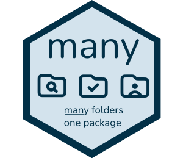

Use _many_ directories to build R packages.

This allows using many folders to write R packages,
letting you structure the project more or less how you
but benefiting from the R toolchain around R packages
(testing, documentation, etc.).

## How it works

The function `bundle` looks for
`.R` files in the `srcpkg` and simply copies
them to the `/R` directory whilst tracking
changes in the `.many` file.
If that process fails you can run `reset` to clear
that file the subsequent `bundle` run will force copy all files.

- The `srcpkg` can contain multiple nested directories,
for an example look at the source code of this package.
Everything else remains the same, e.g.: use of `inst`, etc.
- Set the `MANY_VERBOSE` environment variable to `FALSE` if
you want to switch off all messages.
- Run `tidy()` to clean up old files but you should not have
to do this, it's handled in `bundle()`.
- If you run into any issue you can always reset the tracking by
running `many::reset()` (you will NOT lose any progress).
